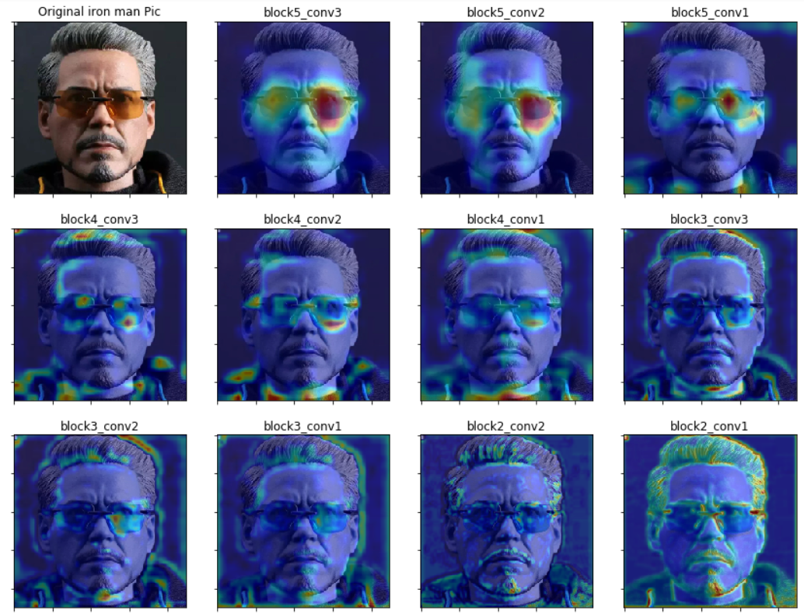

# EVA-2-Assignment10

- This assignment is about observing _Grad cam_ focus area of CNN on different layers.
- This assignment also shows how to observe a specific class on a image using _Grad cam_ 
## Observetions from Assignment
- Different Layers observe different parts of image
- Images are in desending order of layers (starting images are from layers near to prediction layer)
- Initial layers (like block1_conv1, block1_conv2 etc) (Layers far from prediction layer) focus more on small features like edges and gradients
- However Final layers (like block5_conv3, block5_conv2, block5_conv1) focus more on class of the image.(In this case they are sunshades)

- __Image shows how different layers activate over the same image.__
- Here final layers are focusing on sunshades of tony stark. Which is a class in VGG-16 network
