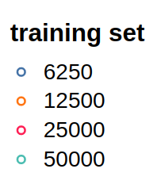

# Eva-2-assignment-12

## Summary
- In this assignment about how Parameter tuning mainly learning rate as hyper parameter plays an important role in generating highly accurate models in less training time.
- Single cycle learning rate is a technique where learning rate acts as a regularization parameter. And in each epoc we choose a best highest learning rate which helps to converge the model faster.

- Learning rate also depends on several other hyper parameters like batch size, weight decay, momentum etc.
- Not just learning rate there are other techniques for achieving more accuracy in less time. In this assignment we will go trough them in detail.

## How to optmise a network (tldr;)
In this assignmen i am going to explain what i have understood from [this](https://myrtle.ai/how-to-train-your-resnet/) series of blogs.
- we all know that generally learning rates of order 0.0* are used. But why dint we use higher learning rates. There are multiple reasons for this one if we use higher learning rates then network will eventually start forgeting the earlier batches in a epoc because of large updates in every batch.
- First let us come to bach size. Increasing batch will lead to curvature instability at a lower learning rate. Hence we need to maintain ```learning_rate*bachsize``` constant. you can observe that for any size of data, model will start diverging at same learning rate. but dont forget that batch size effects forgetfulness.
 
Legend of above plot with different dataset sizes\

- Lets us increase the batch size and try the same experiment
 
Legend of above plot with different dataset sizes\

- When the entire size of data is large. using large learning rate will lead network to forget initial batches or data.
- In the below plot ,model is trained on very high learning rate. as a result model is unable to extract information from data. Observe that the loss is same for half and full datasets. It happends because of network forgetting 

- but if we reduce the learning rate loss becomes better on larger dataset. therefore we can say that learning rate is effected by size of data. More the data Lesser should be learning rate if the batch size is small.

- As mentioned earlier smaller batch size will lead to a regime where forgetfulness dominates and larger batch size is dominated by curvature effect.(I am confused about this at this point)

- Residual connections in a network allows loss to flow gradients smoothly along the model and regularises the network 
- Because of this regularization network will have less local optima. As a result reaching global optima takes less time.
- The rate of improvement from training for longer seems slow compared to the improvements achievable by using deeper architectures
- Batch normalization will take a lot of time for computation. Finding an alternative for that will save a lot of time during tarining. Maybe recidual networks could be key for this. need to explore. observe the below plot

-  Here are some plots showing correlations between different hyper parameters.
[!hyper parameters rels](image/hyper_parameters_rels.png)
- Above Each plot has a ridge of maximal test accuracy oriented at 45° to the axes and spanning a wide range in log-parameter space.So out parameter space will not be straight forward if we continue parameter finding directly. See the below diagram

- let us represent learning rate as __λ__, momentum as __ρ__ and weight decay as __α__
- to optimise the first search space to second. we need to tune the hyper parameters in the order __((λ*α/1−ρ),ρ,α)__. For mathematical proof please refer [here](https://myrtle.ai/how-to-train-your-resnet-5-hyperparameters/). This will convert the search space from first to second in above image
- we can observe the results of parameter tuning in the table below

- The above table provide striking evidence of almost-flat directions in which __(λ*α/1−ρ)__ are held constant. While tweaking rest parameters. Which gives better results.
- This is it for now .There are many other factors which make the network efficient. I will update with them as soon as i get better clarity. 
