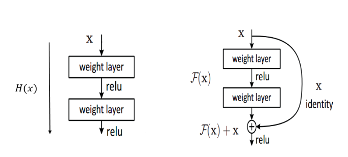
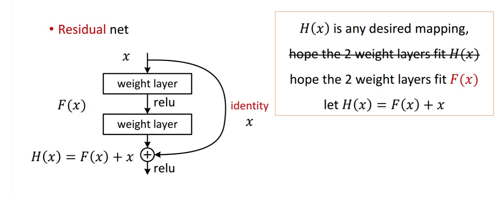
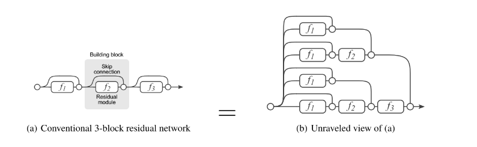
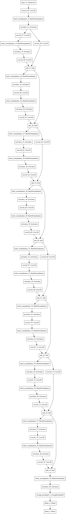

# Assignment13

## This assignment is about traininig Cifar-10 with resnet-18

### What is RESNET

- resnet full form is residual networks
- There are Residual connections in the resnet architrectuire. residual connections are identity coneections.

- These Identity connections solve a lot of problems that normal CNN architecture cant solve.
  1. Identity connections help in adding the weights from previous layer to the next layer. As a result this helps in smooth flow of gradient during back propagation. This solves vanishing gradient and explosion problems
  
  2. Resnet connections let the gradient to skip the current layer if required. Skipping the layer lets the model take care of objects with different sizes .As a result we need to worry less about receptive field of the model. 
  
  we can observe this from the above image where a gradient can flow in multiple paths. So Model is flexible to choose multiple receptive fields. 
  
  
In this assignment ,I have reached an accuracy of 87.09 on cifar-10 with the following architecture

With minor tweaks much higher accuracies can be achieved. I will update the assignment as soon as i improve accuracy. 
