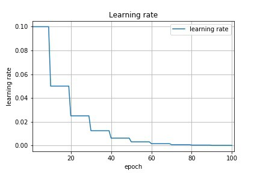

# EVA-2-Assignment-4

# This Python Notebook is about Hyper parameter Tuning

One of the most important Hyper parameter is __Learning Rate__

## 1. Learning Rate
  - Learning rate is how fast the networks adjusts its weights to reach an optimal state
  - In general Initially learning rate should be high and as the network converges the learning rate should decrease as shown in figure
    
    - This is because initially weights are random values but once the network is trained they adjust to an optimal value
    - As a result higher learning rates results in overshooting from local minima
  - Cyclic learning rate is a concept of varying the loss for different batches in a single epoch. This helps the model to not to get stuck in a local minima(I have not tried it Yet to be tried)

## 2. Number of layers and maxpooling
  - these two hyper parameters are inter related
  - As the number of maxpooling layers increase convolution layers decrease
  - Maxpooling reduces the resolution of channels drastically if used in initial layers
  - Therefore maxpooling should be done in a controlled way
  - It would give much better results if we use maxpooling after some patters are formed on channels. This generally happens when
    - GRF(global receptive field) of channel becomes 7*7 for a 32*32 MNIST Image. #UCML #UOSC #UCLA
    - But this is relative to the image resolution. _If the GRE required  to recognise gradient flow of an edge in a image is high then we may require more GRE before maxpooling_ . (ie. __High resolution => more layers before maxpooling__)
  - But the tradeoff if maxpooling reduces the number of parameters. Reducing the complexity of model at the cost of data loss

## 3. 1X1 convolution:
  - It is used to reduce the number of channels . As shown below
  
  - 1x1 should only be used to reduce channels count if the channel count is unnecessarily high.
  - However it will result in some data loss, if not used properly

## 4. Dropout:
  - Should be used if the model overfits. Reduces the speed of convergence of Train accuracy. Which give us a scope of improvement on existing model
  - Causes data loss. But if the data is complex then it will lead to better results on validation accuracy.

## 5. EPOCS:
  - Depends on the Optimizer. Adam optimizer converges fast so less EPOCS are required while SGD(stochastic gradient descent) converge at larger number of epocs.
  - If used more number of time leads to overfitting. But again overfitting is a relative term ;-)

## 6. Type of Optimizer:
Till now i have tried SGD and Adam
  - __Adam__ converges fast and was giving more accuracy on MNIST. _However Controlling Learning rate according to training is the key to achieve better convergence._
  - __SGD__ will take time to converge because it train the data set one by one but not in batches. SGD have a momentum feature which helps to get out of local minima.
## 7. Batch Size:
  - Batch size is the number of samples we consider on each iteration.
  - Many factors affect batch size.
  - for simple datasets lower batch size gives more test accuracy while this may not true for complex datasets.
  - Batch size will also depend on number of classes in dataset . Generally good batch size is a multiple of number of classes.
  - larger batch size with larger learning rate works well . But May or may not converge with a good accuracy.
  - So initially using higher batch size and reducing the batch size with number of EPOCS will generally give good results.

## 8. Image Normalization:
  - usually Improves the accuracy

> There are Lot of other Hyper parameters to tune apart from these. Till now I tried and found these most useful and will update the README as soon as I try a new Hyper parameter :-)

