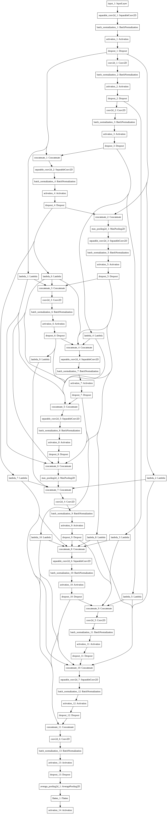

# EVA-2 Assignment-7

## This repository consists of Implementation of CNN Classification Model generated trough ENAS using Keras

# what is ENAS
- ENAS is Efficient Neural Architecture Search
- ENAS employs reinforcement learning to build convolutional neural networks (CNNs) and recurrent neural networks (RNNs)
- Here we implemented following CNN. Whose accuracy beaten human accuracy

- Below Image shows the Image of model implemented in keras and the assignment7.ipynb have the associated code.

