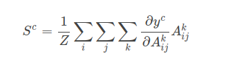
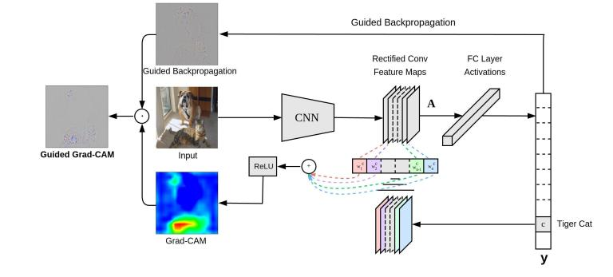
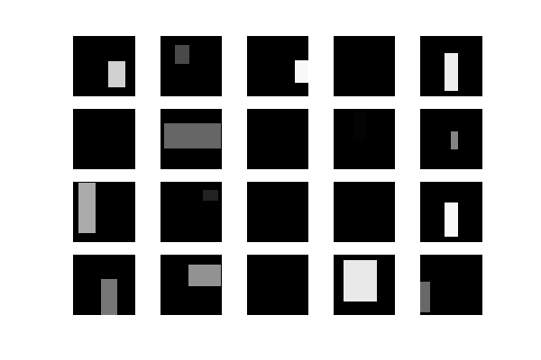
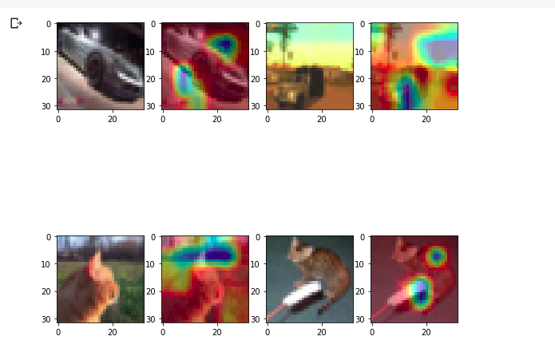
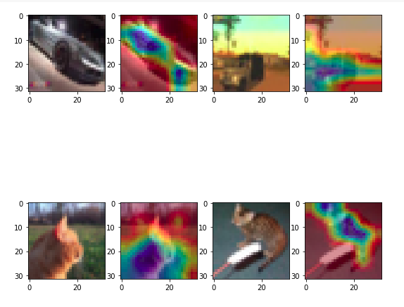

# EVA-2-Assignment-9

## This assignment is about 
- implementation of GRAD-CAM(Gradient weighted Class Activation Map) 
- Improving the Model by using observing CUT-OUT Image Augmentation
> __NOTE__ : I have used CIFAR-10 dataset

## What is GRAD-CAM ?
> Gradient-weighted Class Activation Mapping (Grad-CAM), uses the gradients of any target concept (say logits for ‘dog’ or even a caption), flowing into the final convolutional layer to produce a coarse localization map highlighting the important regions in the image for predicting the concept.

So, to explain in simple terms, we simply take the final convolutional feature map and then we weigh every channel in that feature with the gradient of the class with respect to the channel. It’s just nothing but how intensely the input image activates different channels by how important each channel is with regard to the class. The best part is it doesn’t require any re-training or change in the existing architecture.

The spatial score of a specific class Sc is nothing but the global average pooling over two dimensions i and j for the gradient of respective class output yc with respect to the feature map Akij. Then, we multiply the resulting value with the feature map along with its channel axis k. We then average/pool the resultant over the channel dimension k. Thus, resulting in the spatial score map of size i×j. The ∑ is used to describe the pooling and average operation.

__GRAD-CAM Architecture__

[SOURCE](https://www.hackevolve.com/where-cnn-is-looking-grad-cam/)

## What is CUT-OUT ?
- Cutout is a type of image augmentation methods for convolutional neural networks (CNN).
- It try to regularize models using training images that are randomly masked with mean values.

- as showin in above image we randomly remove some patches from image and replace them with 0 or mean of the respective pixels
[SOURCE](https://github.com/yu4u/cutout-random-erasing)

## Results :
__Samples GRAD-CAM outputs without CUT-OUT image Agumanetation__

- We can clearly observe that these images are mis-classified because of two reasons
  - Eighter they are focusing on background rather than on the image object (Observe the cat in the third image).
  - Or they are focusing on very small part of the image object (Observe the cat in the final image)

>Now let us observe what happends if we use CUT_OUT

__Samples GRAD-CAM outputs with CUT-OUT image Agumanetation__
- We can clearly observe that now the model is focusing on
  - Object in the image not background
  - And covering entire Object. Not just a small part of object

### For detailed Understanding along with code. Please refer to file assignment_9.ipynb in this repository

