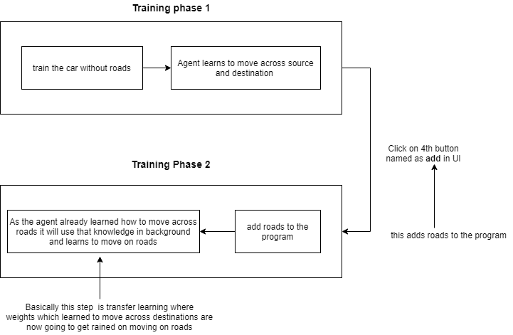

# EndGame-Assignment

## Implementation of self driving car using TD3 algorithm

## Training self driving car on TD3 deep reinforcement learning algorithm 

__Note__ :  please checkout the __two-phase-learning__ branch of this repository [here](https://github.com/abhilashreddyy/EndGame-Assignment/tree/two-phase-learning). where i have written __different version of the implementation__ _with detailed documentataion_
## Summary of what is done 
- Added CNN to calculate state from image
    - replaced the sensor input with cropped & rotated Image input
- Inputting the orientation of the car to neural network
    - __NOTE__ : Please refer to Actor and Critic Images to understand better
    - Without orientation car was stumbling here and therewhile staying on road. 
    - So added orientation to acknowledge the agent to reach destiny
- Shifted the entire update operation to car.py from brain.update()
- removed tanh activation __to stop__ the __ghumr effect__
- reduced the LR of the optmiser

__Note__ : Refer [this](https://youtu.be/A6wUZMdBIzE) link to see video of how car was training. Top right and bottom left corners are two destinations. Same as assignment 7. Now in inference I have placed icons at source and destination.

## Inference
- To run the trained model use
``` sh
python inference.py
```
- And then Load the model
- __NOTE__ : I have trainied a better model but failed to save the model. But if you run this model you can clearly see that the model is trying to stay on roads while moving towards destination. But the current model can get trained better with more computation.

## Detailed explanation :
- Started solving the assignment by fixing the TD3 into asssignment 7 
    - Initially, Implemented the update function in the ai.py module
    - Then i messed up some part in collecting the last state and rewards (___Realising this had consumed a lot of time___). I tried to restructure the entire update function and write my custom update function in TD3 class from what i have understood. But I dont know for some reason it was not working quiet well. Car was always rotating around itself
    - After that, restructured the entire code again and shifted the update function into car.py update function
- Then added done condition to the code. 
- Now the car was able to go straight on road but was unable to take turns.
    - To solve this i have tried to increase exploration coefficient(__expl_noise__) and changed the different shapes of output channels in CNN layer. This had resulted in some exploration of car .But notthing significant
- Then i have tried to play with the rewards
    - Incresased the reward for living from -0.2 to 0.2
    - This resulted in car trying to stay on road but unable to learn to reach the destination
    - Later decreased the reward of moving towards the destination and staying on road. This resulted in car tending more to travel on sand. 
- Added orientation to the network by appending it to the output of the CNN layer. I havent quiet tested it thoroughly
- Removed Tanh beliving that tanh is pushing the output to extrimities of rotating angle
- Tried reduced learning rate coefficient of the optmizer.
- removed tanh activation __to stop__ the __ghumr effect__
- reduced the LR of the optmiser

Most of my time was consumed in merging the TD3 into assignment7. I did not get much time play with different hyper parameters or Think more about what more features can i add to actions and states parameters so that model can train better. 

## Parameters and done condition :
- image size : 60x60
- done 
    - collides the walls : -1
    - reaches the destination : 2
    - move on sand & go away from destination : -0.5
    - move on sand & go towards destination : -0.2
    - move on road & go away from destination : -0.24
        - __meaning that moving towards destination is more important than staying on road__
        - __this essentially helps to stop ghumr effect in long training__
    - move on road & go towards the destination : 0.1
- batch size : 30
- buffer capacity : 2000
- start time steps before using model to predict action : 900
- These are some key parameters i have used


## I will try the following in the future:
- After listening to @prateeks clues on group. I have implemented the learning in 2 phases
- Please take a look at the __two-phase-learning__ ___branch in this repository___. 
    - You can find the code for two-phase-learning [here](https://github.com/abhilashreddyy/EndGame-Assignment/tree/two-phase-learning). Along with the instructions for running the program. 
- I am trying to execute the entire program in two phases. where in phase one agent learns to travel across destinations while in phase 2 it learns to stay on roads while travelling along destinations
- [this](https://github.com/abhilashreddyy/EndGame-Assignment/tree/two-phase-learning) is how the implementation looks like

- I am trying to solve the problem in [this](https://github.com/abhilashreddyy/EndGame-Assignment/tree/two-phase-learning) way now. Hope it leads me to solution.


I believe that trying these things out will defenitely open gates for new ideas and intutions and Improve the model further


__Refer__ [this](https://youtu.be/A6wUZMdBIzE) link to see some video of how car was training.
- These are some small instances of recording while the model was training.
- It can be observed that the model is trying to reach the destination and also trying to stay on roads.


__NOTE__ : I dont have GPU so I was unable to do much hyper parameter tuning
 
 ### New Actor model
 
 
 ### New critic model
 
