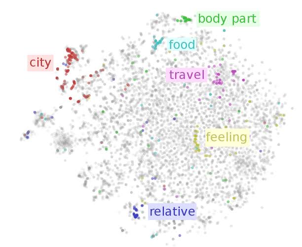
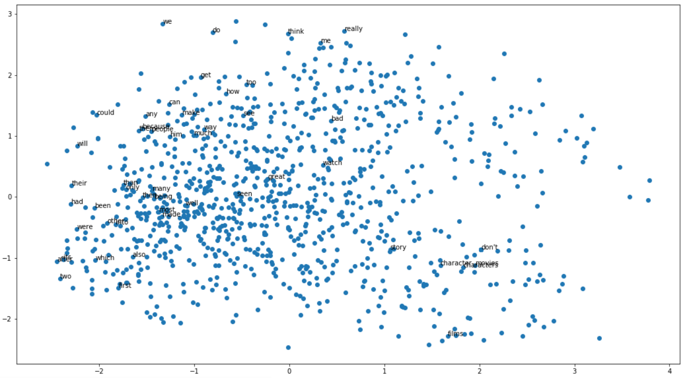
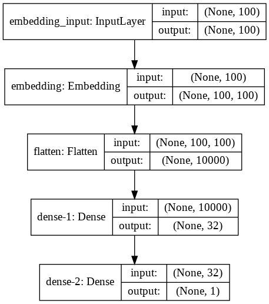
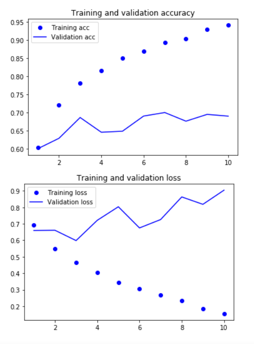

# Eva Phase 2 Assignment-1

- In this notebook we
   - generated one hot encoding from text
   - used Glove word embeddings for training imdb sentiment classifier using neural network

- I have tried to plot some vectors of words used in movie reviews. This is how they look like

- below is the plot for the loass and accuracy of the model on train and test data
![accuracy and loss plots](images/train_val.PNG]

- Used 8000 movie reviews to train and 10000 movie reviews to validate neural network shown below

- Plot of accuracy and Loss of train and validation dataset

__Validation Accuracy__ : 70% \
__Validation Loss__ : increased from 0.65 to 0.90 

> NOTE : As the data set sample is very small model is naturally overfitted. We can observe this from above plot

